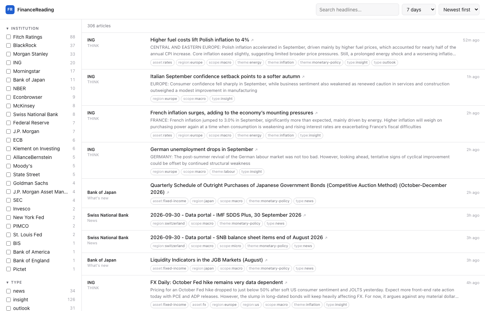

# FinanceReading

One panel for the insights, outlooks and market commentary published by
financial institutions. Headlines from every source in one dense, filterable
list; clicking a headline opens the original article on the publisher's own
site.

```
docker compose up -d --build
open http://localhost:3000
```



- **Tags and filters.** Every article is tagged by type, scope (macro/micro),
  asset class, region and theme. The sidebar filters on them: OR within a
  group, AND across groups. Filters live in the URL, so any view is
  bookmarkable.
- **Links out, always.** The panel is an index, not a reader. Titles link
  straight to the publisher.
- **Five ways to fetch.** Most insight hubs are JavaScript search applications
  with no feed, so an RSS reader alone will not do.

---

## The problem this solves

The pages worth reading are not homepages. They look like this:

```
https://www.pimco.com/eu/en/insights#sort=%40publishz32xdate%20descending&f:category=[70341f6d…]
```

Two things are true about that URL, and they shape the whole design:

1. `@publishz32xdate` is **Coveo** field-name encoding (`z32x` is how Coveo
   escapes characters in field names). The page is a search application, and
   the articles arrive by JSON after the HTML does. Fetch that URL over plain
   HTTP and you get an empty shell — a CSS scraper finds nothing.
2. Everything after `#` is a **fragment**, which browsers never send to the
   server. Those category GUIDs are facet values the page posts to its own
   search API.

So the job is not "write a scraper". It is **find the JSON endpoint behind each
page and replay it** — which gives cleaner data than the rendered HTML, and
keeps working when the site is redesigned.

`npm run discover` does that hunting for you.

> **That PIMCO URL is history, and it makes the point.** As of September 2026
> the page makes no article request at all — the hunter watches it render and
> captures nothing but cookie-consent traffic. The Coveo app was replaced.
> Which is exactly why the answer is a hunting command rather than a list of
> endpoints: any endpoint written into this README is a dead link waiting to
> happen. `goldman-insights` in `config/sources.yaml` is the worked example of
> a hunt that paid off.

---

## Download and install

You need **Node.js 22 or newer** and **git**. Docker is optional (it is the
easiest way to leave it running in the background).

```bash
git clone https://github.com/AtimaneAtix/FinanceReading.git
cd FinanceReading
npm install
```

Then either:

```bash
npm run ingest:once && npm start     # fetch every source once, then serve
```

and open <http://localhost:3000>, or, with Docker instead of Node:

```bash
docker compose up -d --build
```

Update later with `git pull && npm install`. The plain-language guide to
running it day to day is [docs/USER_MANUAL.md](docs/USER_MANUAL.md).

> `npm install` compiles `better-sqlite3` if no prebuilt binary matches your
> platform, which needs a C++ toolchain (Xcode command-line tools on macOS,
> `build-essential` on Debian/Ubuntu). Playwright is optional and only needed
> for the `browser` adapter and `npm run discover`.

## Getting started

### 1. Look at it before configuring anything

```bash
npm install
npm run demo          # http://localhost:3000
```

Runs the whole system against a built-in fixture — a feed, a token-protected
search API, and a sitemap, plus one deliberately broken source so the health
strip has something to show. No internet needed.

### 2. Find out which real sources work

```bash
docker compose up -d --build
docker compose exec web npm run doctor
```

`doctor` fetches every source in `config/sources.yaml` right now and prints a
table of what worked. **Expect red on the first run.** The seed list was
written without the ability to reach these domains, so it is a starting grid,
not a verified list. Prune what is dead, then hunt replacements.

### 3. Hunt the sources that failed

```bash
docker compose --profile hunter run --rm hunter https://www.pimco.com/eu/en/insights
```

The hunter opens the page in a real browser and runs five probes:

| Probe | What it looks for |
|---|---|
| Network capture | Every XHR/fetch the page makes, scored on whether the JSON holds article-shaped records. This finds the search API. |
| Framework data | `__NEXT_DATA__`, Nuxt payloads, AEM model endpoints. |
| Feeds | `<link rel="alternate">`, plus the conventional `/rss`, `/feed`, `/atom.xml` paths. |
| Sitemaps | `robots.txt` → `sitemap.xml`, including news sitemaps. |
| HTML structure | Repeated article containers, as a last resort. |

It prints a ranked report and **a config block you can paste into
`config/sources.yaml`**, then writes the full report to `config/discovered/`.

Captured bearer tokens are never written into the suggestion — they are
replaced with `{{token}}` plus a rule for re-minting them, because these tokens
expire within the hour.

**Faster path:** open the listing page yourself, DevTools → Network → Fetch/XHR,
copy the article request as cURL, and write the `json` adapter from that
directly. The hunter automates that loop; it does not replace your judgement.

---

## Adapters

Declared per source. Always take the highest one that works.

| Kind | Use when | Notes |
|---|---|---|
| `json` | The site has a search or content API | **Preferred.** Structured, paginated, survives redesigns. |
| `rss` | A real feed exists | Cheapest. Handles RSS 2.0, Atom, RDF. |
| `sitemap` | No feed, no reachable API | Finds new URLs, then reads each article's own OpenGraph/JSON-LD. Works on JavaScript sites. |
| `html` | Server-rendered listing page | Brittle. Verified by `doctor`. |
| `browser` | Nothing else works | Renders in Chromium. Slow; use sparingly. |

A source may declare `fallback:` adapters, tried in order when the primary
fails or returns nothing — so an API change degrades to fewer fields rather
than to silence.

### Examples

```yaml
# A plain feed.
- id: fed-press
  institution: Federal Reserve
  name: Press releases
  homepage: https://www.federalreserve.gov
  static_tags: [type:news, scope:macro, region:us]
  adapter:
    kind: rss
    url: https://www.federalreserve.gov/feeds/press_all.xml

# A real content API, found by `npm run discover`. No token, no pagination:
# it returns the whole corpus, so the cap ranks by date before it cuts.
- id: goldman-insights
  institution: Goldman Sachs
  name: Insights
  homepage: https://www.goldmansachs.com
  static_tags: [type:insight]
  adapter:
    kind: json
    request:
      method: GET
      url: https://www.goldmansachs.com/feeds/insights.json
    items_path: ''            # empty: the records are the top-level array
    fields:                   # dot paths within one record
      title: title
      url: slug               # a path, not a URL — resolved against `homepage`
      summary: description
      published_at: cmsPageProps.publishDate
      categories:             # one path, or several
        - cmsPageProps.pageType
        - cmsPageProps.contentType[].title
        - cmsPageProps.series[].title
        - cmsPageProps.primaryTopic[].title
    max_new_per_run: 25
  fallback:
    - kind: sitemap
      url: https://www.goldmansachs.com/sitemap.xml
      include: ['/insights/']

# A search API behind a JavaScript page, with a token minted by that page.
- id: example-insights
  institution: Example Asset Management
  name: Insights
  homepage: https://www.example.com
  static_tags: [type:insight]
  adapter:
    kind: json
    request:
      method: POST
      url: https://exampleprod.org.coveo.com/rest/search/v2
      headers: { content-type: application/json, authorization: "Bearer {{token}}" }
      body: '{"aq":"@objecttype==Insight","firstResult":{{offset}},"numberOfResults":{{page_size}}}'
    auth:
      kind: from_page                       # or `env` with a var name, or `none`
      page_url: https://www.example.com/insights
      token_regex: '"accessToken"\s*:\s*"([^"]+)"'
    items_path: results
    fields:
      title: title
      url: clickUri
      summary: excerpt
      published_at: raw.publishdate
      categories: raw.category
    pagination: { kind: offset, page_size: 50, max_pages: 2 }
```

Templates `{{token}}`, `{{offset}}`, `{{page}}` and `{{page_size}}` are
substituted into the URL, headers and body.

**Field paths.** `a.b`, `a.b[0].c`, and `a.b[].c` — the last fans the rest of
the path out over an array, which is how a CMS usually hands over its taxonomy:
as objects, not as bare strings. `categories` takes a list of paths as well as
a single one, because a CMS rarely keeps its whole taxonomy in one place.

---

## Tags

`config/taxonomy.yaml` defines the facets and how tags are assigned. Two
mechanisms, in order of quality:

```yaml
# 1. The publisher's own categories, mapped straight through. Best signal
#    available — better than any keyword rule. `npm run retag` prints the
#    categories your sources emit that nothing maps yet.
native_map:
  "Economic and Market Commentary": [scope:macro, type:commentary]
  "70341f6de3a142ee89144df0ec44e3b8": [asset:fixed-income]

# 2. Case-insensitive regex over the title and summary.
rules:
  - tag: asset:credit
    any: ['\bcredit\b', 'high yield', 'investment grade', '\bspread']
    none: ['credit card']          # optional
    all: []                        # optional; every term must match
```

A source can also declare `static_tags`, applied to everything it produces.

After editing, re-apply to everything already stored — nothing is re-fetched:

```bash
docker compose exec web npm run retag
```

Expect to tune this in the first week. That command makes tuning free.

---

## Commands

| Command | What it does |
|---|---|
| `npm run demo` | The whole system against a local fixture. No internet. |
| `npm run doctor` | Fetch every source now; print what worked and why the rest did not. |
| `npm run discover -- <url>` | Hunt the article source behind a listing page. |
| `npm run retag` | Re-apply the taxonomy to stored articles. |
| `npm run prune` | Show what a 365-day cut would remove. Add `--apply` to do it. |
| `npm run ingest:once` | One ingestion pass, then exit. |
| `npm test` | Unit and integration tests, including a fixture of each adapter. |
| `npm run typecheck` | TypeScript, no emit. |

---

## Storage, and pruning

One file grows as this runs: `data/feeds.db`. Everything else is incidental —
`config/discovered/*.json` appears only when you run `discover`, and the app
writes no logs.

Growth is slower than it looks. The panel takes on the order of **ten
publisher-dated articles a day**, weekday-heavy, and an article costs about
1.1 KB with its tags and index entries — so the database puts on roughly **4 MB
a year** and would need a decade or two to become inconvenient. Size is not a
reason to prune.

Ageing the reading list is. The default cut is **365 days**, and what "older
than" means is decided per article, because `published_at` carries two different
kinds of fact:

| The article's date | Judged on | Because |
|---|---|---|
| Stated by the publisher (`date_estimated = 0`) | `published_at` | It is a real publication date. |
| Estimated (`date_estimated = 1`) | `first_seen_at` | The stored date is a sitemap `lastmod` — a CMS rebuild stamp — or just the moment of first sight. It goes a year after it reached your list, not a year after a timestamp nobody vouched for. |

Roughly two in five stored articles carry an estimated date, so this is not an
edge case. It errs towards keeping: an ancient page whose CMS restamped it
yesterday survives, rather than a recent one being deleted on a bad guess.

`npm run prune` shows what a cut would remove and deletes nothing; `--apply`
goes ahead, and `--older-than=180d` moves the line:

```bash
npm run prune                                # what a 365-day cut would take
npm run prune -- --older-than=180d --apply
```

**Pruning remembers what it removed**, in `pruned_urls`, and that is not
incidental. A feed's window reaches much further back than its length suggests
— CBRT's publications feed still lists items from 2023, the New York Fed's
reaches back a year — and the `rss` and `json` adapters judge novelty against
the items table alone. Delete an article that is still inside its feed's window
without a tombstone and it returns on the very next run, to be deleted again on
the next pass, for ever. Only the `sitemap` adapter is naturally immune,
because `seen_urls` already remembers for it.

That permanence is also why a cut under 30 days needs `--force`: a pruned
article is not coming back.

---

## How it works

```
config/sources.yaml ──▶ worker ──▶ adapter ──▶ normalise ──▶ dedupe ──▶ tag ──▶ SQLite
                                                                                  │
                          config/taxonomy.yaml ───────────────────────────────────┘
                                                                                  │
                                                        web (Fastify) ◀───────────┘
                                                              │
                                                        the panel
```

Two services share one SQLite file in WAL mode: the worker writes, the web
server reads. That is why there is no database server to run.

**Deduplication happens twice**, because both kinds occur:

- *Exact*: the canonical URL — host lowercased, fragment dropped, `utm_*` and
  click IDs stripped, trailing slash removed — hashed and uniquely indexed.
- *Near*: a normalised title from the same institution within seven days. This
  is what collapses the `/us/en/` and `/eu/en/` copies of one article.

**A few articles per source per run.** `take_per_run` (default 5) is what each
source may contribute each time it is polled. The panel is a reading list, not
an archive: a handful per source keeps every institution visible instead of
letting whichever one publishes most bury the rest, and a first run fills with
what is current rather than with a decade of back catalogue.

What does not fit is not dropped — articles already stored are skipped
*before* the cap, so the rest are still there next run and the queue drains a
few at a time. Take the newest five outright and the same five are chosen on
every run: the sixth article never arrives.

One rule comes with it. A sitemap adapter's own `max_new_per_run` is a *crawl*
budget, and it must not exceed `take_per_run`. The adapter records every URL it
visits so a broken page is not retried forever, so an article it fetched and
the run then dropped would never be offered again. `doctor` and the worker both
refuse to start on that combination rather than lose articles quietly.

**A date the publisher did not state is not a date.** A sitemap's `lastmod` is
a rebuild timestamp — publishers re-stamp whole sections at once — so an
article dated only by `lastmod` is marked estimated, and the panel sorts every
genuinely dated article above the estimated ones rather than letting a
decade-old page pose as this morning's news. Such a source is also rationed:
`max_undated_per_run` (default 5) stops the run once it has taken that many
undated articles. Entries are visited in `lastmod` order and every URL visited
is recorded, so the next run resumes past that point: the source arrives a few
at a time instead of in one dump, and the crawl costs five requests rather than
twenty-five.

**Be clear about what that ration is not.** It bounds how much undated material
enters at once; it does not know which articles are newest, because on a source
like this nothing does. `lastmod` order is rebuild order — Morgan Stanley's
five most recently rebuilt pages are articles from 2024 — so the ration picks
the least-stale-looking few, not the latest few. The only real fix is to read
the date the publisher actually stated, which is why `extractArticleMeta`
casts as wide a net as it does, and why a `json` endpoint that states its dates
outright is worth hunting for.

**Zero items is treated as broken, not quiet.** A scraper that silently stops
returning anything is the most common failure in a system like this, so a
source that returns nothing unexpectedly is marked `EMPTY` and named in the
health strip at the bottom of the panel. Failing sources back off
exponentially, up to sixteen times their normal interval.

**Politeness.** One request per source per interval, serialised per host with a
minimum gap, `robots.txt` respected and cached for twelve hours, identifying
User-Agent, conditional requests (`If-None-Match` / `If-Modified-Since`) so an
unchanged feed costs nothing.

---

## Configuration

`take_per_run` and `poll_minutes` are set under `defaults:` in
`config/sources.yaml`, and either can be overridden on a single source.

| Variable | Default | Purpose |
|---|---|---|
| `PORT` | `3000` | Web server port. |
| `DB_PATH` | `data/feeds.db` | SQLite file. |
| `SOURCES_PATH` / `TAXONOMY_PATH` | `config/…` | Config locations. |
| `INGEST_CONCURRENCY` | `4` | Sources fetched in parallel. |
| `INGEST_TICK_MS` | `60000` | How often the worker looks for due sources. |
| `HOST_MIN_GAP_MS` | `1000` | Minimum gap between requests to one host. |
| `USER_AGENT` | identifying default | Sent on every request. |
| `CHROMIUM_PATH` | — | Browser for the `browser` adapter and the hunter. |
| `HTTPS_PROXY` / `NO_PROXY` | — | Honoured, including CIDR ranges in `NO_PROXY`. |
| `IGNORE_ROBOTS` | — | Set to `1` to skip robots.txt. Off by default, deliberately. |

---

## Adding a source, end to end

1. `npm run discover -- <the listing page URL>`
2. Review the suggested block; paste it under `sources:` in `config/sources.yaml`.
3. `npm run doctor` — confirm it comes back green.
4. `npm run retag` — read the list of unmapped publisher categories it prints,
   and map the useful ones into `native_map`.

---

## Known limits

- The source list in `config/sources.yaml` has been run against the live sites,
  but that is a snapshot, not a guarantee — `imf-blog` is disabled behind
  Akamai, `bbva-research` is disabled behind a sitemap its publisher stopped
  regenerating, and `bofa-institute` spent several hours returning 400 before
  recovering on its own. Run `doctor` before trusting any of it, and read the
  comments: each dead or awkward source says what was tried.
- Three institutions were wanted and could not be reached: **S&P Global**
  answers 403 to everything including `robots.txt`, and **Rabobank** and
  **Allianz Research** do the same to their feed URLs. Reaching any of them
  needs the browser adapter.
- A browser user-agent is not the thing to test a candidate URL with.
  `invesco.com` answers 406 to Chrome and 200 to this project's own agent, so
  a source can look dead in a browser tab and be perfectly alive to the worker.
  Test with `doctor`, not with your browser.
- Only one source (`goldman-insights`) runs on a content API. The rest are
  feeds and sitemaps, so roughly two in five stored articles carry an estimated
  date. Each successful `discover` hunt moves a source out of that group.
- Full article text, AI summaries, PDF outlooks, read/unread state and saved
  articles are not in this version. The schema takes them without a rewrite.
- Sites behind a login or a hard paywall are out of scope.

---

## License and credit

MIT — see [LICENSE](LICENSE). Use it, change it, share it; keep the copyright
notice.

Made by Atilla Serdar Ulaş, built with [Claude](https://claude.com/claude-code).

FinanceReading only links to and briefly indexes what publishers put out
publicly; it is not affiliated with or endorsed by any institution in
`config/sources.yaml`. If you run it, you are responsible for respecting each
site's terms.
